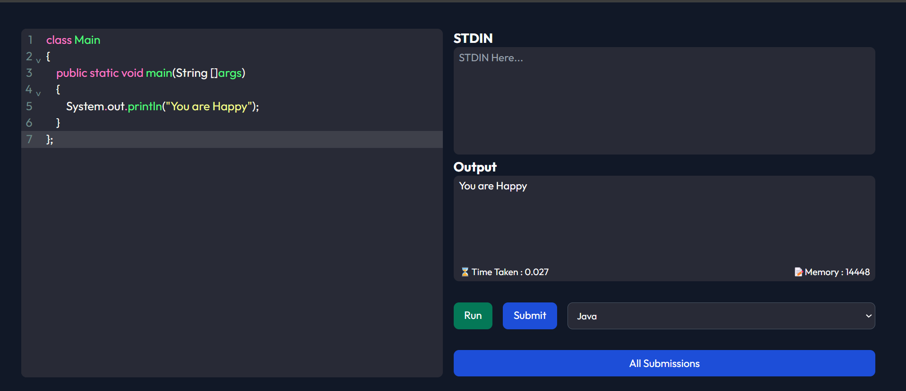
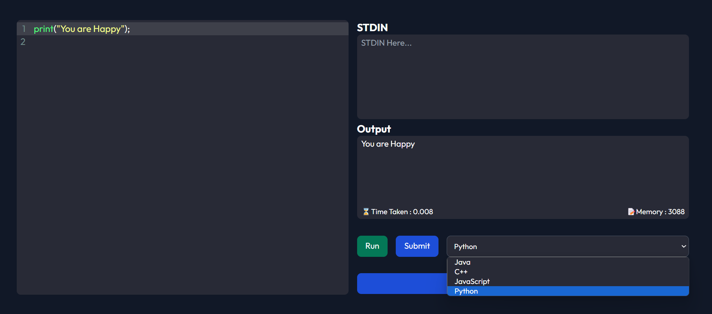

# CodePlay

CodePlay is a dynamic online coding platform designed to empower developers of all levels. With its robust Express.js backend and interactive React frontend, CodePlay offers a seamless environment for coding, collaboration, and creativity.

### Technologies Used:
- React.js
- Express.js
- CORS
- Javascript
- API handling
- tailwind-css-configs

### Setup:
1. Install dependencies using `npm install`.
2. Start the server using `npm start`.
3. The backend server will be running on `http://localhost:3000`.

### API Endpoints:
- **GET /submissions**: Retrieve all submissions.
- **POST /submissions**: Create a new submission.
- **GET /submissions/:id**: Retrieve a specific submission by its ID.

## Frontend

### Technologies Used:
- React
- React Router DOM
- React Hot Toast

### Setup:
1. Install dependencies using `npm install`.
2. Start the development server using `npm start`.
3. The frontend will be accessible on `http://localhost:3000`.
